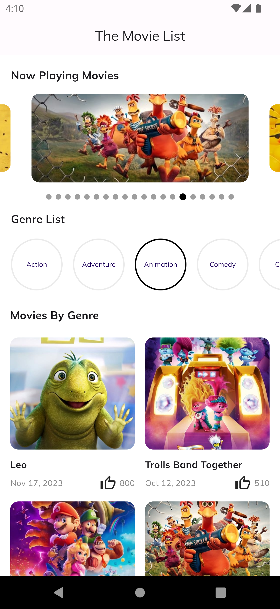
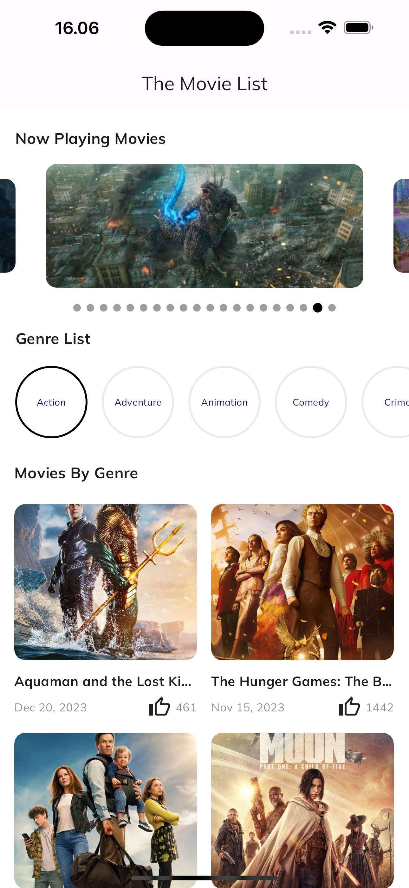
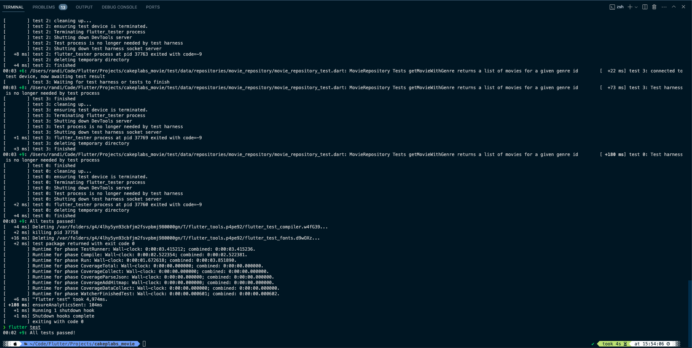

# Cakeplabs - Project Test

## 🎯 Test Details:

- Test Brief:  Kamu dapat menemukan test brief detail pada link ini: https://miro.com/app/board/uXjVN70xaLk=/
- Durasi: Test ini harus diselesaikan dalam waktu 3 hari.
- Format File:  Silahkan kirimkan hasil test dalam bentuk file zip (berisi source code dari proyek project)
- Alokasi waktu test: Berikan penjelasan terkait berapa jam durasi yang diperlukan untuk mengerjakan test ini.

## 📝 Notes:

- Usahakan menggunakan state BLoC untuk pengerjaan test ini

## ⏳ Submission Deadline:

- Hasil test harus dikirim sebelum Hari Senin pukul 10.00 WITA.

## 👨🏻‍🎨 Design:

---

## 🧑🏻‍💻 Result Project Test:

### Android:

### iOS:

### Testing:

---
